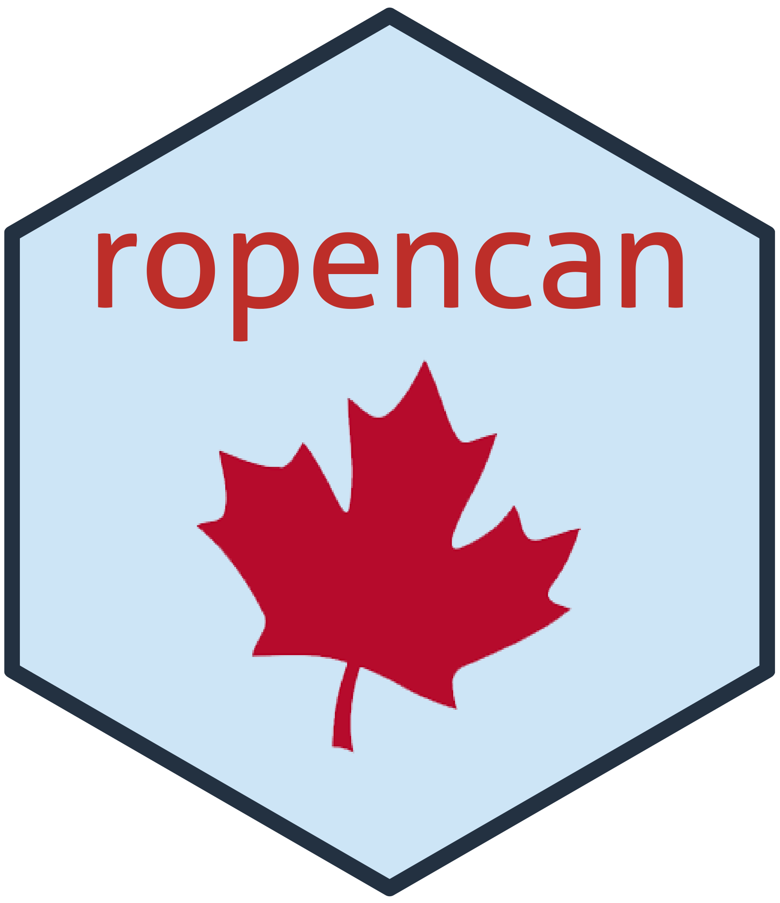

# ropencan: an interface between R and the Canadian Open Government Portal 

### ~ In development, contributions and participation welcome ~

A R package to interact with the Open Canada API, to search and download datasets. It is our hope that we will be able to bring this package up to the standard of a `ropensci` packages. 

The code is under GPL-3 license. 
All the data is under Open Government License (http://open.canada.ca/en/open-government-licence-canada).

Hex Logo done with `hexSticker`: https://github.com/GuangchuangYu/hexSticker

## To install

You will need the `devtools` package to install from source. 

```r
devtools::install_github("vlucet/ropencan")
```

## List of functionalities 

### Search for records on the open portal that matches some keywords 

The function `opencan_search` performs basic queries and outputs a `tibble` with all the query results. 

```r
library(ropencan)
library(dplyr)

search <- opencan_search(keywords = c("dfo", "fish"))
search %>%
  glimpse()
```

### Extract available file formats for a given record from a search 
#### ~ WIP in separate branch ~

The tibble returned by `opencan_search` comprises a column formed of a list of tables. Those tables list the available datasets and file format availables. 
A function `opencan_get_???` will return this information for a given record and will allow the user to download `.CSV` files and possibly `.shp` spatial data files. 
